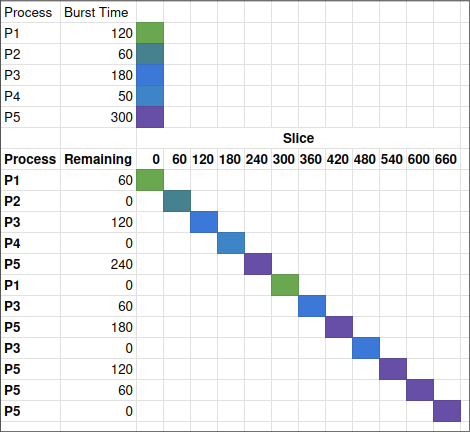

27. Distinguish between application software and system software.

> System software used to manage and control computer hardware and resources where application software is used to perform specific tasks for end users.

29. Explain the term multiprogramming.

> Multiprogramming is the technique of keeping multiple programs in main memory at the same time.

42. Distinguish between logical addresses and physical addresses.

> A logical address is a virtual address generated by the CPU. Physical addresses are a location on the memory unit that physically exists.

59. If the frame size is 1024, what is the physical address associated with the logical address <3,555>?

> 3 \* 1024 + 555 = 3627

60. What is a process control block?

> A process control block is a data structure used by an operating system to store all the information about a process.

66. What is a context switch?

> A context switch is the process of storing the state of a process or thread so that it can be restored and resume execution at a later point and then restoring a different, previously saved, state.

71. Draw a Gantt chart that shows the completion times for each process using round-robin CPU scheduling with a time slice of 60.

