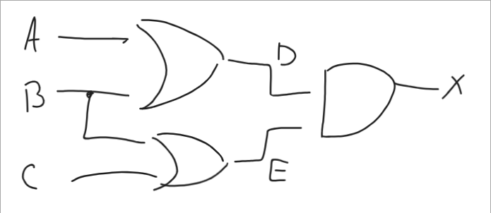
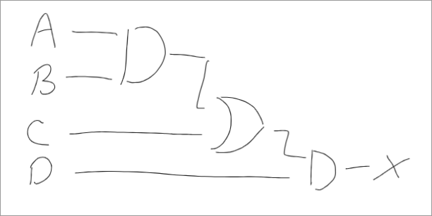

For Exercises 18-29, match the gate with the description of the operation or the deagram.

- A. AND
- B. NAND
- C. XOR
- D. OR
- E. NOR
- F. NOT

18. Inverts its input.
> F. NOT

19. Produces a 1 only if all its inputs are 1 and a 0 otherwise
> A. AND

20. Produces a 0 only if all its inputs are 0 and a 1 otherwise
> D. OR

21. Produces a 0 only if its inputs are the same and a 1 otherwise
> C. XOR

22. Produces a 0 if all its inputs are 1 and a 1 otherwise
> B. NAND

23. Produces a 1 if all its inputs are 0 and a 0 otherwise
> E. NOR

24. _image_
> F. NOT

25. _image_
> A. AND

26. _image_
> D. OR

27. _image_
> C. XOR

28. _image_
> B. NAND

29. _image_
> E. NOR

32. What are the three notational methods for describing the behavior of gates and circuits?
> Boolean expressions, Logic diagrams, Truth table

43. Give the Boolean expression for a three-input AND gate, and then show its behavior with a truth table.
> A x B x C

| A    | B    | C    | X    |
| ---------------- | --------------- | --------------- | --------------- |
| 0    | 0    | 0    | 0    |
| 0    | 0   | 1   | 0   |
| 0   | 1   | 0   | 0   |
| 0 | 1   | 1   | 0   |
| 1 | 0   | 0   | 0   |
| 1 | 0   | 1   | 0   |
| 1 | 1   | 0   | 0   |
| 1 | 1   | 1   | 1   |

44. Give the Boolean expression for a three-input OR gate, and then show its behavior with a truth table.
> A + B + C

| A    | B    | C    | X    |
| ---------------- | --------------- | --------------- | --------------- |
| 0    | 0    | 0    | 0    |
| 0    | 0   | 1   | 1   |
| 0   | 1   | 0   | 1   |
| 0 | 1   | 1   | 1   |
| 1 | 0   | 0   | 1   |
| 1 | 0   | 1   | 1   |
| 1 | 1   | 0   | 1   |
| 1 | 1   | 1   | 1   |

46. How does transistor behave?
> A transistor will either, depending on the voltage  level of the input signal, act as a wire that conducts electricity or as a resistor that blocks the flow of electricity.

55. Draw a circuit diagram corresponding to the following Boolean expressions: (A + B)(B + C)

56. Draw a circuit diagram corresponding to the following Boolean expressions: (AB + C)D

59. Show the behavior of the following circuit with a truth table: _image_
> AB + (A + B)

| A | B | AB | A + B | AB + (A +B) |
| - | - | -- | ----- | ----------- |
| 0 | 0 | 0  | 0     | 0           |
| 0 | 1 | 0  | 1     | 1           |
| 1 | 0 | 0  | 1     | 1           |
| 1 | 1 | 1  | 1     | 1           |

62. Show the behavior of the following circuit with a truth table: _image_
> (AB + C')' + (BC)'

| A | B | C | AB | C' | AB + C' | (BC)' | (AB + C')' + (BC)' |
| - | - | - | -- | -- | ------- | ----- | ------------------ |
| 0 | 0 | 0 | 0  | 1  | 1       | 1     | 1                  |
| 0 | 0 | 1 | 0  | 0  | 0       | 1     | 1                  |
| 0 | 1 | 0 | 0  | 1  | 1       | 1     | 1                  |
| 0 | 1 | 1 | 0  | 0  | 0       | 0     | 0                  |
| 1 | 0 | 0 | 0  | 1  | 1       | 0     | 1                  |
| 1 | 0 | 1 | 0  | 0  | 0       | 1     | 1                  |
| 1 | 1 | 0 | 1  | 1  | 1       | 1     | 1                  |
| 1 | 1 | 1 | 1  | 0  | 1       | 0     | 1                  |

63. What is circuit equivalence?
> When two circuits produce exactly the same output for each input value combination.

68. a. Circuits used for memory are what type of circuits?
> sequential circuits

    b. How many digits does an S-R latch store?
> a single binary digit

    c. The design for an S-R shown in Figure 4.12 guarantees what about the outputs X and Y?
> They are always compliments of each other.
